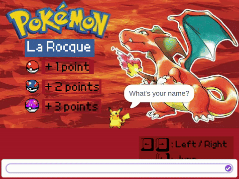

<!-- Typing SVG -->

<!-- Banner -->

  

<!-- Badges -->

  
  
  
  

## Content
- [About Me](#about-me)
- [Main Repositories](#main-repositories)
- [42 Projects](#42-projects)
- [Personal Projects](#personal-projects)

---

##  About Me

<!-- Stack Badges -->

  
  
  
  
  
  
  
  

Since childhood, I've been fascinated by humanity's remarkable ability to start from basic principles and arrive at technologies that once seemed like magic. That sense of wonder never left me, it simply found its place in computing.

- **Developer** focused on low-level programming and embedded electronics.
- **42 Porto** Cadet
- **Founder of MagraThea** — Entrepreneurship & Innovation Club at 42 Portugal
- **Mechanical Engineering (2019–2023)** — FEUP

---

##  Main Repositories
*Click a banner to access the repository*

  
  
  <!-- To do: Insert MagraThea Repo in the future -->
  

---

##  [42](https://42.fr/en/homepage/) Projects

*Here are some of my projects from [**42 Porto**](https://www.42porto.com/pt/). Click the project names to view the repositories. A grade higher than 100 means that the bonus tasks were delivered.*

| Project | Description | Tech Stack | Grade |
| :--- | :--- | :---: | :---: |
| **[minishell](https://github.com/larocquel/42/tree/main/1-Common_Core/Milestone_03/minishell)** | Simplified version of the Bourne-Again Shell (Bash). Done in partnership. | `C` `Bash` `UNIX` `AST` | 100/100 |
| **[philosophers](https://github.com/larocquel/42/tree/main/1-Common_Core/Milestone_03/philosophers)** | Implementation of the Dining Philosophers problem using multithreading and proper resource management. | `C` `Threads` `Mutexes` | 100/100 |
| **[minitalk](https://github.com/larocquel/42/tree/main/1-Common_Core/Milestone_02/minitalk)** | A small data exchange program that uses UNIX signals to communicate strings between a client and a server. | `C` `UNIX Signals` | ★ 115/100 |
| **[so_long](https://github.com/larocquel/42/tree/main/1-Common_Core/Milestone_02/so_long)** | A small 2D game where a character must collect all items on a map and reach the exit. | `C` `MiniLibX` `Game Dev` | 100/100 |
| **[push_swap](https://github.com/larocquel/42/tree/main/1-Common_Core/Milestone_02/push_swap)** | Implementation of an optimized sorting algorithm using two stacks with the minimum possible number of operations. | `C` `Algorithms` `Stacks` | ★ 125/100 |
| **born2beroot** | Setup and configuration of a virtual machine acting as a server, adhering to strict security policies. | `Debian` `VirtualBox` `Bash` | ★ 110/100 |
| **[ft_printf](https://github.com/larocquel/42/tree/main/1-Common_Core/Milestone_01/ft_printf)** | Recreation of the standard C library `printf` function, handling multiple format specifiers and conversions. | `C` `Variadic Funcs` | 100/100 |
| **[get_next_line](https://github.com/larocquel/42/tree/main/1-Common_Core/Milestone_01/get_next_line)** | A function that efficiently reads a line from a file descriptor using static buffers. | `C` `File I/O` | 100/100 |
| **[libft](https://github.com/larocquel/42/tree/main/1-Common_Core/Milestone_00/libft)** | Custom C library re-implementing standard libc functions, including linked list manipulation. | `C` `Data Structures` | ★ 125/100 |

---

##  Personal Projects

<table>
  <tr>
    <td>

### 2WD Autonomous Robot

<em>Building an autonomous vehicle from scratch. Powered by Arduino UNO R3, Ultrasonic &amp; Infrared Sensors.</em>

  
  
  
  
  

</td>
  </tr>
  <tr>
    <td>

### Pokémon La Rocque

  <em>My very first step into programming: a Pokémon game built entirely in <a href="https://scratch.mit.edu/projects/961123940/">scratch.mit.edu</a></em>

  
   
  <a href="https://scratch.mit.edu/projects/961123940/"><strong>Play on Scratch →</strong></a>

</td>
  </tr>
</table>

